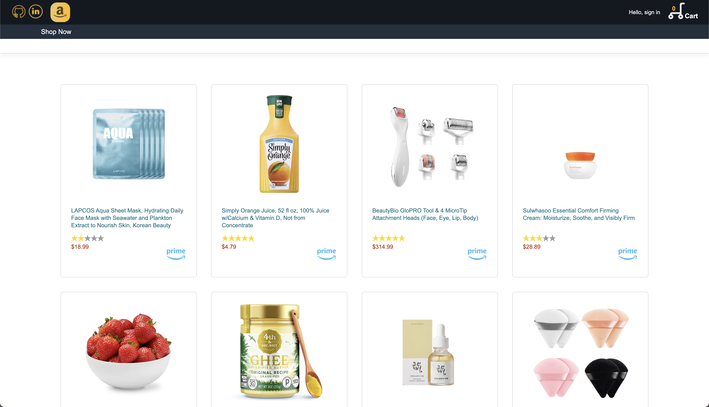
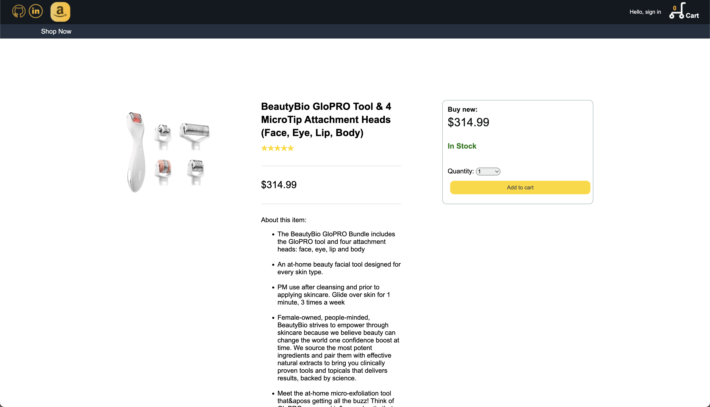
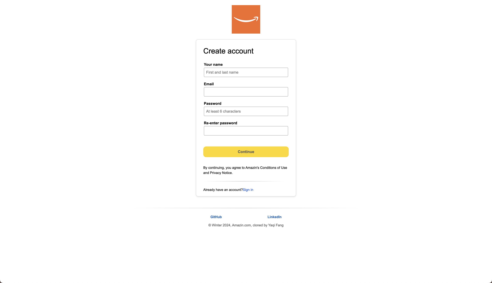
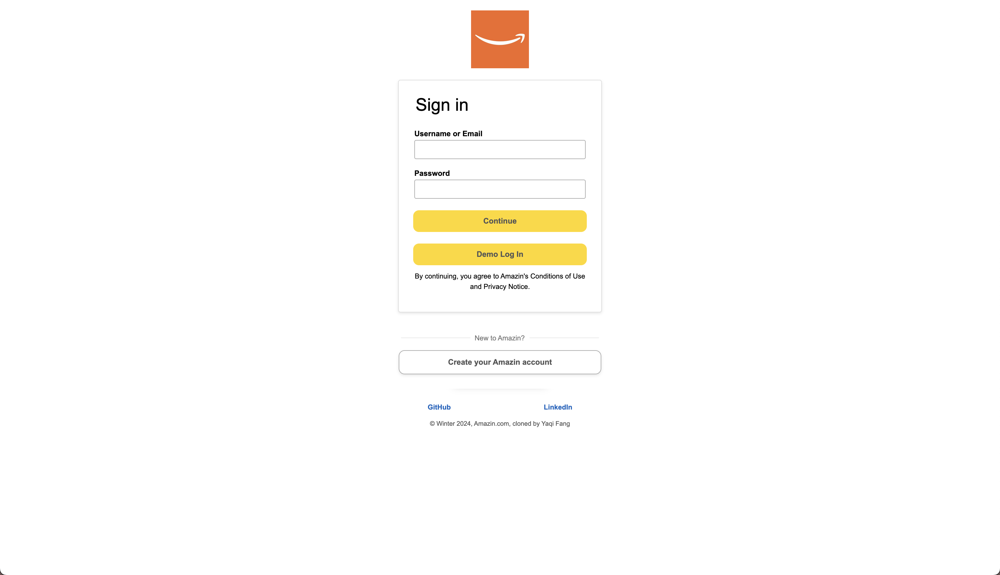

# WELCOME TO AMAZIN

Check out the [Live Site](https://amazin-c8vt.onrender.com/)!

### Introduction

Amazin is a clone of Amazon, a popular e-commerce platform. Users can create accounts, explore a wide range of products, add items to their cart, complete the checkout process, and manage orders. The platform offers personalized recommendations based on user activity. To create a seamless shopping experience, I used technologies like:

* Languages: Javascript, HTML, and CSS
* Frontend: React-Redux
* Backend: Rails (Ruby web framework)
* Database: PostgreSQL
* Hosting: Render

### Run Commands
backend: rails s (http://localhost:5000/)
frontend: npm run dev (http://localhost:5173/)

## Features

### Homepage & Navigation
An Amazin user is able to navigate to the homepage by clicking the Amazin icon in the navigation bar. The navigation bar persists throughout all web show pages, with the exception of login and signup forms. It also includes a dropdown, "Hello, sign in" for a user to sign in or create an account. The final feature in the navbar is the cart which navigates to the cart show page.


```javascript
const HomePage = () => {
    return (
        <div className="homePageDiv">
            <div className="bannerDiv">
                
            </div>
        </div>
    );
}
```

### Browse & Shop
An Amazin user can click 'Shop Now' under the Amazin home icon, and start to browse through available products. Each product has a descriptive name, a rating, a price, as well as a prime sticker. 



```javascript
function ProductsIndex() {
    const dispatch = useDispatch();
    const products = useSelector(selectProductsArray);
    
    useEffect(() => {
        dispatch(fetchProducts());
    }, [dispatch]);
    
    return (
        <ul className='productsIndexPage'>
            <div className="productsIndexDivider"></div>
            <div className="productsContainer">
                {products.map((product, index) => (
                    <NavLink key={`${product.id}_${index}`} to={`/products/${product.id}`}>
                        <div className="productContainer">
                            
                            <div className="containerContent">
                                <p className="productName">{product.name}</p>
                                <Rating rating={product.rating} />
                                <div className="lastLineDiv">
                                    <p className="productPrice">
                                        ${product.price}
                                    </p>
                                    <div className="primeLogoDiv">
                                        
                                    </div>
                                </div>
                            </div>
                        </div>
                    </NavLink>
                ))}
            </div>
        </ul>
    );
}
```

### Item Show Page
An Amazin user can click on any product and it will lead them the item's specific show page. It will show the consumer what the product looks like, the descriptive name of the product, a few distinctive list of features of that product, and the price. Users will have the option to add 1 or more items to their cart. A user must be signed in to add an item to their cart.



```javascript
const ItemIndex = () => {
  const dispatch = useDispatch();
  const { productId } = useParams();
  const product = useSelector(selectProduct(productId));
  const cartItems = useSelector(memoizedSelectCartItems);
  const product_id = parseInt(productId);
  const [quantity, setQuantity] = useState(1);
  const sessionUser = useSelector((state) => state.session.user);
  const navigate = useNavigate();
  
  useEffect(() => {
    dispatch(fetchProduct(productId));
  }, [dispatch, productId]);
  // if the product is not yet available or if the description is not an array
  if (!product) {
    return <div>Loading...</div>;
  }
  // if product.description is not an array or is empty
  if (!Array.isArray(product.description) || product.description.length === 0) {
    return <div>No description available</div>;
  }
  
  const parsedDescription = JSON.parse(product.description[0]);
  
  const handleAddCartItem = async (e) => {
    e.preventDefault();
    if (sessionUser) {
      const user_id = sessionUser.id;
      const productToAdd = { quantity, product_id, user_id };
      const existingCartItem = cartItems.find(
        (item) => item.productId === product.id
      );
      if (existingCartItem) {
        const updatedCartItem = {
          ...existingCartItem,
          quantity: existingCartItem.quantity + quantity,
        };
        dispatch(updateCartItem(updatedCartItem));
      } else {
        dispatch(createCartItem(productToAdd));
      }
    } else {
      navigate("/login");
    }
  };
  
  const handleQuantityChange = (e) => setQuantity(parseInt(e.target.value, 10));
  
  return (
    <div className="itemIndexPage">
      <div className="itemImageContainer">
        
        {/*  */}
      </div>
      <div className="itemContentContainer">
        <div className="middleProductPriceContainer">
          <h3 className="middleProductPriceText">{product.name}</h3>
        </div>
        <div className='reviewContainer'>
          <div className='reviewItemsDiv'><Rating rating={product.rating} /></div>
        </div>
        <div className="middleDivider2"></div>
          <div className="middleProductPriceContainer">
            <p className="middleProductPriceText">${product.price}</p>
          </div>
        <div>
        <div className="middleDivider1"></div>
          <p className="aboutItemTag">About this item:</p>
          <ul className="productDetailList">
            {parsedDescription.map((detail, index) => (
              <li className="productDetail" key={`${product.id}_${index}`}>
                {detail}
                <br/>
                <br/>
              </li>
            ))}
          </ul>
        </div>
      </div>
      
      <div className="addToCartContainer">
        <div className="buyNew">
          <h3>Buy new:</h3>
        </div>
        <div className="productPriceContainer">
          <h1 className="productPriceText">${product.price}</h1>
        </div>
        <div className="inStockContainer">
          <h1 className="inStockText">In Stock</h1>
        </div>
        <div className="quantityContainer">
          <span>Quantity: </span>
          <select
            className="quantityDropDown"
            name="quantity"
            value={quantity}
            onChange={handleQuantityChange}
          >
            <option value="1">1</option>
            <option value="2">2</option>
            <option value="3">3</option>
            <option value="4">4</option>
            <option value="5">5</option>
            <option value="6">6</option>
            <option value="7">7</option>
            <option value="8">8</option>
            <option value="9">9</option>
            <option value="10">10</option>
          </select>
        </div>
        <div className="addToCartButton">
          <button onClick={handleAddCartItem} className="addToCartBtn">
            Add to cart
          </button>
        </div>
      </div>
    </div>
  );
};
```

### User Authentication

In order for an Amazin user to add an item to the cart, they must have an account and but logged in. 




```javascript
function Navigation() {
    const sessionUser = useSelector((state) => state.session.user);
    const dispatch = useDispatch();
    const cartItems = useSelector(memoizedSelectCartItems);
    
    const logout = (e) => {
        e.preventDefault();
        dispatch(sessionActions.logout());
    };
    const totalCount = cartItems.reduce((total, item) => total + item.quantity, 0);
    
    const sessionLinks = sessionUser ? (
    <ul>
        <li>
            <button className='dropdwnSignoutBtn' onClick={logout}>Log Out</button>
        </li>
    </ul>
    ) : (
    <ul> 
        <li className='dropdwnSign'>
            <NavLink id='dropdwnLoginBtn' to='/login'>Log in</NavLink>
        </li>
        <li>
            <NavLink id='signup' to="/signup">New costumer? Start here</NavLink>
        </li>
    </ul>
    );
    
    return (
    <>
        <div className='navBar'>
            <div className='git'>
                <a href="https://github.com/cfang322">
                    
                </a>
            </div>
            <div className='linkedin'>
                <a href="https://www.linkedin.com/in/yaqi-fang-125807250/">
                    
                </a>
            </div>
            
            <div className='home'>
                <NavLink to="/">
                    
                </NavLink>
            </div>
            
            <li className="dropdown">
                <button className="dropbtn">{sessionUser ? `Hello, ${sessionUser.username}` : "Hello, sign in"}</button>
                <div className="dropdown-content">
                    {sessionLinks}
                </div>
            </li>
            
            <div className='cart'>
                <NavLink to="cart" id="cartLink">
                    <p className='cartNumber'>{totalCount}</p>
                    
                    <p className="cartWord">Cart</p>
                </NavLink>
            </div>
        </div>
        
        <div className='secondBar'>
            <NavLink to="products" id="productsLink">
                <p className='ProductIndexLink'>Shop Now</p>            
            </NavLink>
        </div>
    </>
    );
```

### Feature Goals
* Complete styling for CartIndex and CartItemIndex

* Add Lower Navbar

* Add Categories Components 

* Add Search Bar

### Thanks